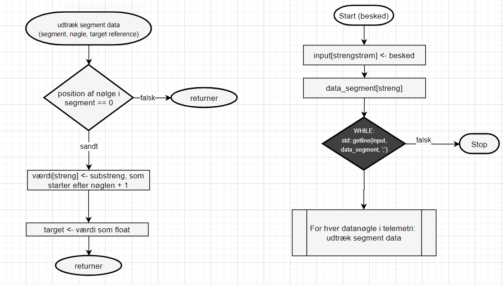

**Overordnet klassediagram:**


## 3 lags arkitektur

Dette program er designet efter et princip om løst sammenkoblede funktionsakser. Derfor passer 3-lags arkitekturen ikke super godt på mit program.

### Data lag

Datalaget i dette program, sørger for 3 ting: lytte og sende UDP, hente video, gemme billeder og eventuelt video. 

**Klassediagram:**


**UDP-Serveren:**

```c++
Tello::UDP::UDP(std::string ip_address, u_short send_port, u_short listen_port)
{
    SDK_Address = ip_address;
    SDK_SendPort = send_port;
    SDK_ListenPort = listen_port;

    SDK_loop = uvw::Loop::getDefault();

    SDK_server = SDK_loop->resource<uvw::UDPHandle>();

    // Handle server error
    SDK_server->on<uvw::ErrorEvent>([](const uvw::ErrorEvent& error, uvw::UDPHandle& handle) {
        std::cout << "SERVER ERROR(" << error.name() << "," << error.code() << "): " << error.what() << std::endl;
        handle.close();
    });

    // Handle server udp packet recieved. I used a lambda function because referencing the other function directly didn't work
    SDK_server->on<uvw::UDPDataEvent>([this](const uvw::UDPDataEvent& data, uvw::UDPHandle& handle) {
        SDK_handle_recieve(data, handle);
    });

    SDK_server->bind("0.0.0.0", listen_port);
    SDK_server->recv();

    async_server = SDK_loop->resource<uvw::AsyncHandle>();

    async_server->on<uvw::AsyncEvent>([this](const auto&, auto&) {
        if (!is_running) {
            async_server->close();
            SDK_server->close();
            SDK_server->stop();
            SDK_loop->stop();
        }
    });

    SDK_thread = std::thread(run_service, std::ref(SDK_loop), std::ref(is_running));
}
```

**Omskrivning af koden, så den bedre passer til 3-lags arkitekturen:**

Jeg ville nok ikke ændre så meget i konstruktøren. Dog så ville jeg i SDK_handle_recieve, fjerne referencerne til telemetri og queue, så klassen blev mere generel.


### Logik lag

Koden indeholder ikke sådan rigtigt et "rent" logik lag. Dette er fordi logikken enten er koblet på datalaget eller præsentationslaget.


**Funktionskald diagram:**




**Kode:**

```c++

void extract_segment_data(std::string segment, std::string key, float& target)
{
    if (segment.find(key) == 0) {
        target = static_cast<float>(atof(segment.substr(key.length()).c_str()));
    }
}

Tello::Telemetry::Telemetry(std::string message)
{
    std::stringstream input(message);
    std::string data_segment;

    while (std::getline(input, data_segment, ';')) {
        extract_segment_data(data_segment, "pitch:", pitch);
        extract_segment_data(data_segment, "yaw:", yaw);
        extract_segment_data(data_segment, "roll:", roll);

        extract_segment_data(data_segment, "vgx:", velocity.x);
        extract_segment_data(data_segment, "vgy:", velocity.y);
        extract_segment_data(data_segment, "vgz:", velocity.z);

        extract_segment_data(data_segment, "agx:", acceleration.x);
        extract_segment_data(data_segment, "agy:", acceleration.y);
        extract_segment_data(data_segment, "agz:", acceleration.z);

        extract_segment_data(data_segment, "h:", height);

        extract_segment_data(data_segment, "time:", flight_time);
        extract_segment_data(data_segment, "tof:", flight_distance);

        extract_segment_data(data_segment, "templ:", lowest_temperature);
        extract_segment_data(data_segment, "temph:", highest_temperature);

        extract_segment_data(data_segment, "bat:", batterypercentage);
        extract_segment_data(data_segment, "baro:", barometer);
    }
}

bool Tello::Telemetry::CheckIfTelemetry(std::string message)
{
    return message.find("pitch:") != std::string::npos
        && message.find("roll:") != std::string::npos
        && message.find("yaw:") != std::string::npos;
}
```

**Omskrivning af koden, så den bedre passer til 3-lags arkitekturen:**

Denne kode ville jeg sige passer nogenlunde godt i 3 lags arkitekturen, og jeg ikke se hvordan det kunne fås til at passe bedre.


### Præsentationslag

Præsentationslaget er meget rodet i dette projekt. Lige nu står det for: tegne video, tegne imgui, sætte gemme mappen til billeder, start og stop af servere, Inputs, RC og mere. Alt sammen i en klasse Tello::UI

Diagram over videodisplay:


Tegn video:

```c++
void Tello::UI::Run()
{
    while (window->isOpen()) {
        ...
        if (video_connected && video_server != nullptr)
            video_server->applyBufferToTexture(video_texture);
        Draw_SFML();
        ...
    }
}

void Tello::UI::Draw_SFML()
{
    if (video_connected && video_server != nullptr) {
        auto win_size = window->getSize();
        auto sprite_size = video_sprite.getTexture()->getSize();
        sf::Vector2f sprite_scaling = { (float)sprite_size.x / win_size.x, (float)sprite_size.y / win_size.y };
        video_sprite.setScale(
            (win_size.x * 0.666667) / video_texture.getSize().x, 
            (win_size.y * 0.5) / video_texture.getSize().y);

        window->draw(video_sprite);
    }
}
```

**Omskrivning af koden, så den bedre passer til 3-lags arkitekturen:**

Man kunne gøre meget, jeg ville nok trækker events, ImGui, fildialoger og RC ud i sine egne klasser.